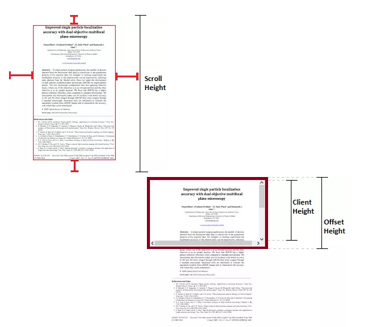
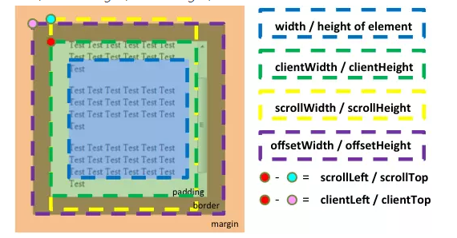

`clientHeight scrollHeight offsetHeight scrollTop offsetTop clientTop的区别`  

`clientHeight` 表示可视区域的高度 不包含border和滚动条  
`offsetHeight` 表示可视区域的高度 包含border和滚动条  
`scrollHeight` 表示所有区域的高度 包含因为滚动被隐藏的部分

`clientTop` 表示边框border的厚度 在未指定情况下一般为0  
`scrollTop` 滚动后被隐藏的高度 获取对象相当于offsetParent属性指定的父坐标（CSS定位的元素或body元素）距离顶端的高度  

---
`蚂蚁部落：http://www.softwhy.com/article-2513-1.html`  

`offsetTop`
- offset偏移量
- 返回当前元素顶部相对`指定元素`顶部的偏移量
- `指定元素`由当前元素的`offsetParent属性`决定
  - 距离当前元素最近的采用定位祖先元素
  - 如果祖先元素没有采用定位的元素，则返回body元素
  - 详细看`offsetTop.html`